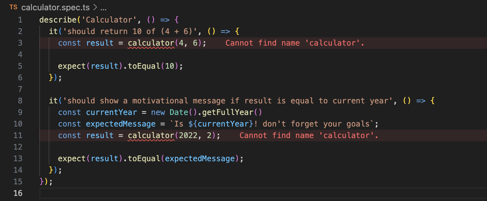
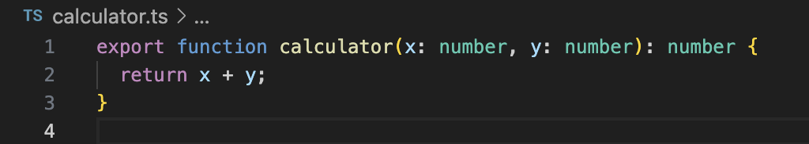
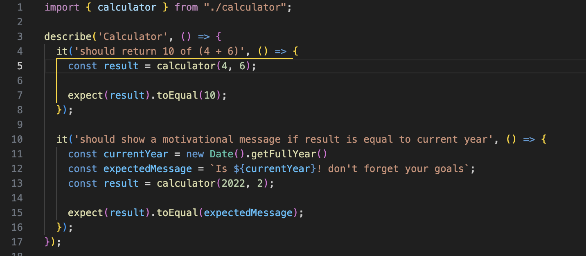
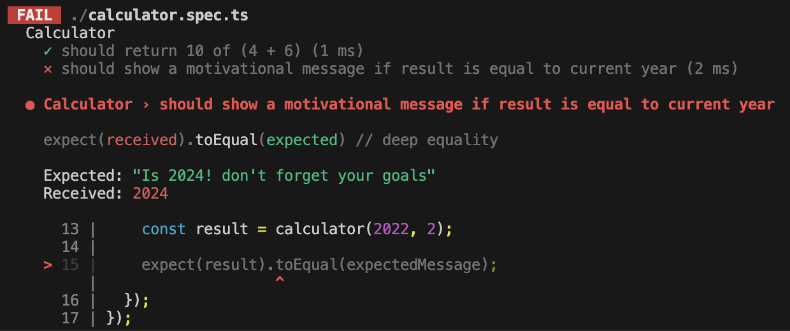
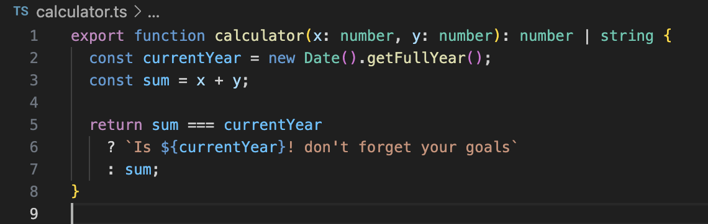
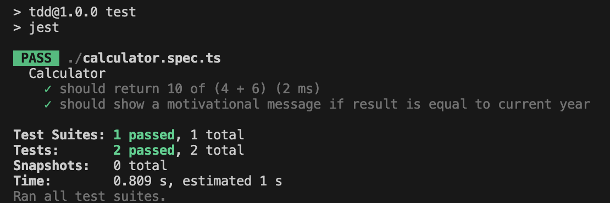

# TDD

¿Testear código que no existe? Sí, pero no te asustes (aún no...) es mucho más sencillo de lo que parece y lo entenderás en menos de 3 minutos.

Pero primero, entendamos un poco los conceptos teóricos.

TDD (Test Driven Development) es una metodología que asiste a los desarrolladores en la creación de código y pruebas de manera eficiente. La estrategia central es escribir primero los tests y luego el código, asegurando que este último cumpla con los requisitos establecidos por los tests.

Recomiendo este paso por paso para poner en práctica TDD:

1. Crear Red tests
2. Hacer Green tests
3. Hacer Refactors (Clean code, code smells)

Veamos estos 3 puntos de manera práctica.

## Practica

El cliente X solicita crear una calculadora con una función especial. Por ahora, solo le interesa que sume dos números y retorne el resultado de la suma. Si en dado caso, la suma de los dos números es igual al año actual, deberá mostrarle al usuario un mensaje motivacional:  "Is xxxx! don't forget your goals"

### Red tests

Necesitamos comenzar a crear los tests y que estos fallen... pero antes de eso, identifiquemos los requerimientos:

- Retornar la suma de dos números.
- Retornar un mensaje si el resultado de la suma coincide con el año actual.

Un tip para empezar es pensar en un mínimo de casos de prueba que cumplan los requisitos. Con esto, no nos estancamos en pensar sin actuar. En este ejemplo, hemos creado dos casos a cubrir.

En este caso, si ejecutamos los tests, estos estarán en rojo ya que la función 'calculator' no existe.

### Green tests

Ahora debemos hacer que el codigo que vamos a escribir cumpla con los requisitos de los test unitarios para que estos puedan estar en verde.

Importamos esa función en los tests.

Ejecutamos los tests.

Ups! Debemos ajustar el código... no estamos cumpliendo con un requerimiento.

Ahora sí, tenemos todos los tests en verde.

### Refactors

Bien, ya cumplimos con lo mínimo requerido, ¿y ahora qué? Verifiquemos cómo podemos mejorar el código e incluso agregar nuevos casos de prueba. Pero esa será tu tarea de práctica...

## Conclusiones

TDD no es nada complicado: creamos los casos de prueba, desarrollamos el código, lo refactorizamos y repetimos el proceso. Lo único desafiante es que reta las costumbres habituales de muchos desarrolladores al invertir el proceso tradicional, colocando los tests al frente. Pero esto solo es cuestión de práctica y adaptación.

# Recursos

[GitHub](https://github.com/jacksonguerrer0/TDD-example)